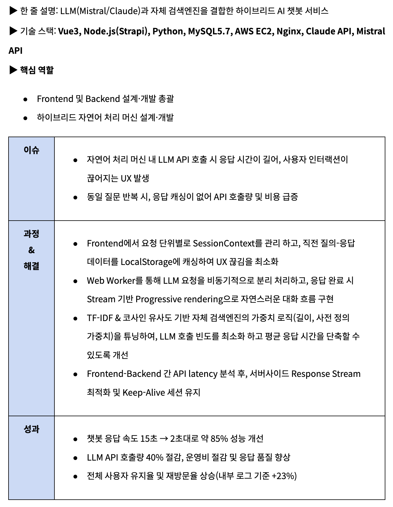
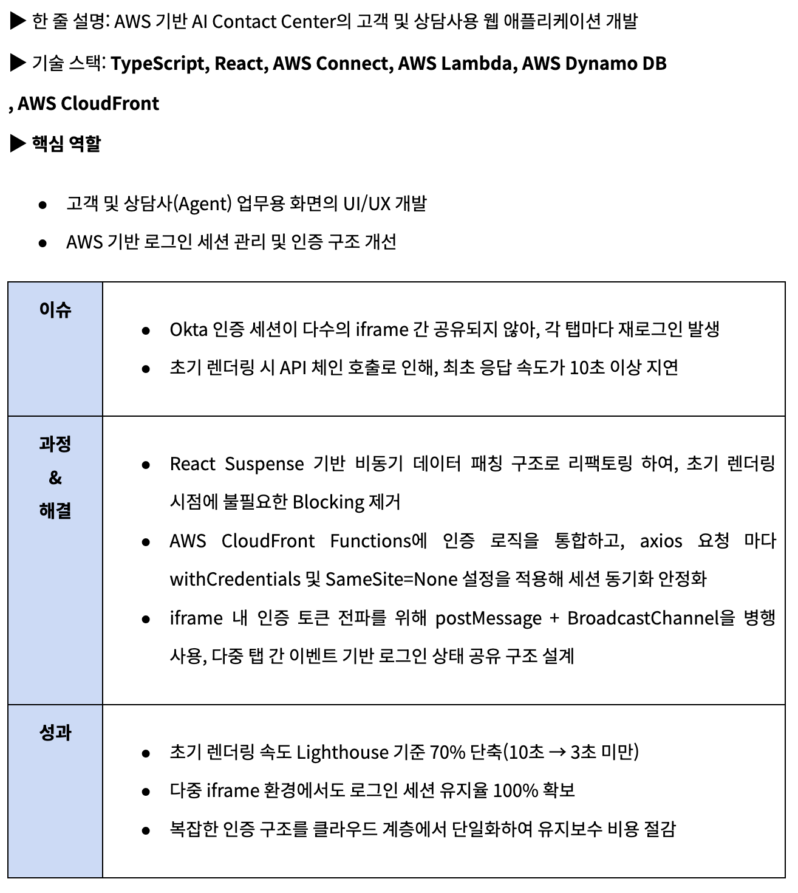
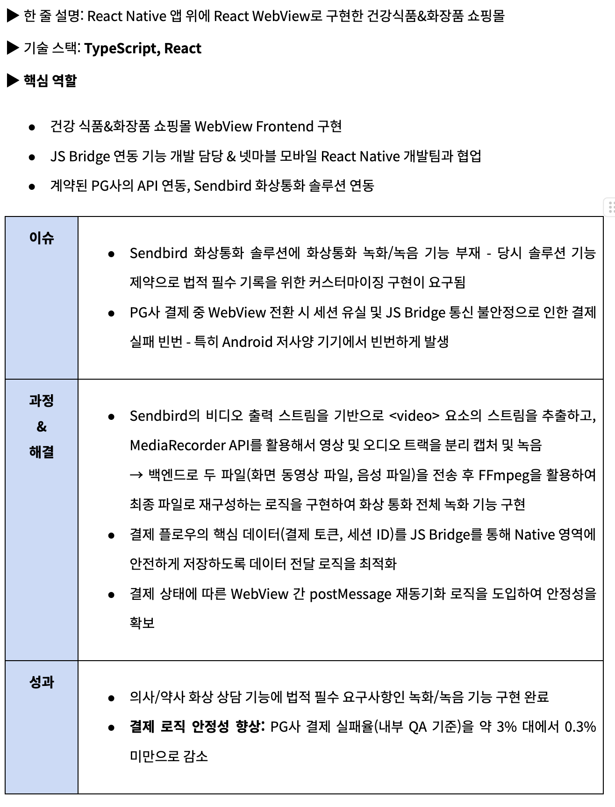
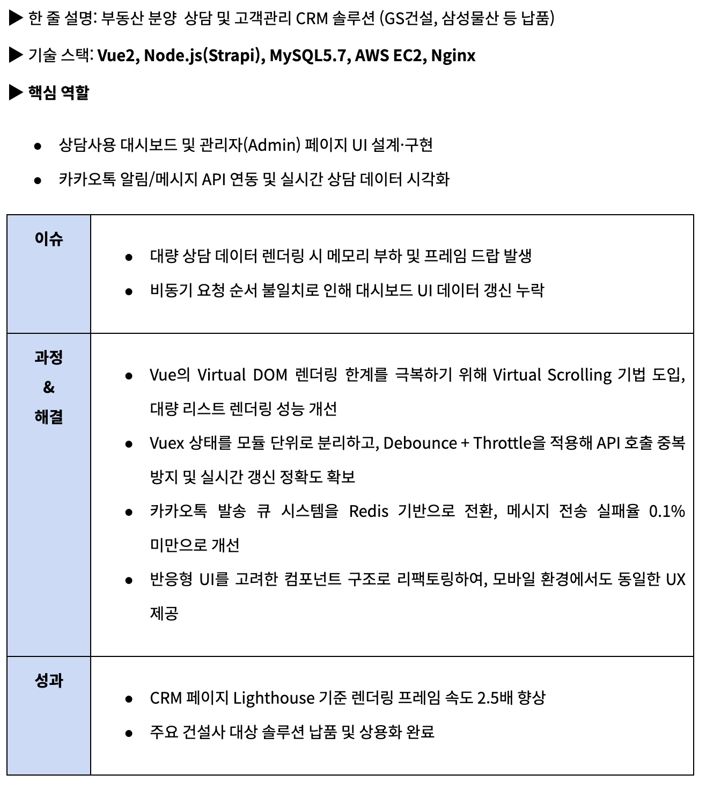

# 박경실(GYEONGSIL PARK)

> Javascript / Typescript / Node 기반의 풀스택 개발자로, 약 5년간 다양한 솔루션 및 서비스 개발에 참여해왔습니다. 아름다운 코드와 구조로 아름다운 제품을 만들기 위해 끊임없이 노력합니다. 실제 사용자 니즈를 빠르게 파악하고 반영하는 개발을 강점으로 삼고 있습니다.

---

## 👤 **기본 정보**

- **Email:** [gps.siri92@gmail.com](mailto:gps.siri92@gmail.com)
- **GitHub:** [https://github.com/GPS-siri](https://github.com/GPS-siri)
- **연락처:** 010-9052-2896

### **보유 기술 (Skills)**

#### Frontend

- 메인기술: `TypeScript`, `React`, `Vue`
- State Management(캐싱, 전역상태): `React Query(TanStack Query)`, `Redux`, `Recoil`, `Vuex`
- Styling: `Styled-components`, `Tailwind CSS`

#### API & Data

- `GraphQL(Apollo)`, `RESTful API`

#### Backend / Cloud & Infrastructure

- Backend: `Node.js`, `Strapi`
- AWS: `EC2`, `S3`, `Lex`, `Dynamo DB`, `Lambda`, `API Gateway`, `Connect`

#### Tools

- 협업 툴: `Jira`, `Slack`
- 개발 툴: `Visual Studio Code(VSCode)`
- 디자인 툴: `Figma`

---

### **업무 경력 (Work Experience)**

#### 프로텍트(Protect) (2020.08.20 ~ 2025.04.30) - 4년 10개월 | 정규직 | 개발팀
▶ AI 챗봇 서비스, AI Contact Center 구축, 쇼핑몰 개발 및 CRM 솔루션 개발 등 다양한 프로젝트의 Frontend 및 Backend 개발, 시스템 최적화를 담당했습니다. AI 챗봇의 응답 속도를 85% 향상하고, AICC 프로젝트의 초기 렌더링 속도를 70% 단축하는 등 성능 병목을 해결하고 사용자 경험을 개선하는데 집중했습니다.

---

### **주요 프로젝트**

- **AI Chatbot "AI 지혜(AI-Jihye)"서비스 (2023.12 ~ 2025.04)[(AI-Jihye: https://ai-jihye.com/)](https://ai-jihye.com/)**

- **대한항공 AICC(AI Contact Center) 구축 프로젝트 (2024.03 ~ 2025.03)**

- **(주)힐러비 / 넷마블 - 구독가능 건강관리 식품&화장품 쇼핑몰 개발(2022.02 ~ 2023.06)**

- **분양 CRM-Here 서비스 개발 [(Here Service: https://here.re.kr)](https://here.re.kr)**

 
---

### **기타 참여 프로젝트**

- **영업자 관리 CRM - Members Here 서비스 개발**

  - 사용기술: `Vue` / `Node`(strapi) / `MySQL5.7` / `AWS EC2` / `Nginx`
  - 어드민 페이지 개발 참여
  - 전국적으로 미분양 발생에따른 조직분양 도입에 따라 영업자를 관리하고, 커미션을 정산하기 위하여 개발된 솔루션

- **미분양 해결 플랫폼 - MGM Here**

  - [MGM-Here](https://www.mgm-here.com)
  - 사용기술: `Vue` / `Node`(strapi) / `MySQL5.7` / `AWS EC2` / `Nginx`
  - 기존에 엑셀로 하던 리스트 작업들을 시스템화 하여, 간단하고 획일화되고 중앙집중적으로 관리하게 해주는 솔루션
  - 분양대행사가 지역공인 중개사와 협동하여, 고객을 유치하고 커미션을 받는 구조의 미분양 해결 솔루션 개발
  - 삼일산업, 푸르지오 납품

- **삼성멀티캠퍼스 통합로그인 시스템 개발**

  - 사용기술: `Vue`
  - 멀티캠퍼스 & 한국지식 교육협회 SSO 시스템 Frontend 개발
  - 학습 커리큘럼 코스 기능 추가 개발

- **LG전자 상업용 세탁기 관리자 페이지 개발**

  - 사용기술: `Vue`
  - 세탁기 운영 현황 모니터링 시스템 구축 개발
  - Chart.js 라이브러리 활용한 대시보드 화면 개발

---

### 학력 및 자격

#### ▶ 학력

- 대구한의대학교 IT전공 졸업 (2011-2017)
- 학점: 3.79/4.5

#### ▶ 자격증

- 정보처리기사 (2016.05.16 취득)

#### ▶ 해외 경험

- UMS (미국) IT부서 QA 업무 (2018.05.25 - 2019.06.03)

---

- **자기소개:**

“아름다움을 설계하는 개발자, 박경실입니다.”
5년간의 개발 경력 동안, 저는 빠르게 완성하는 개발자에서 “아름답게 완성하는 개발자”로 성장했습니다.
단순히 작동하는 코드를 넘어서, 구조적으로 이해하기 쉬우며 유지보수가 용이한 코드를 추구 합니다.
React와 Vue, Node.js 기반의 프로젝트를 수행하며, 서비스의 성능과 사용자 경험을 함께 개선하는데 집중했습니다.
특히, 대한항공 AICC 프로젝트에서는 로그인 세션 병목과 렌더링 지연 문제를 CloudFront functions로 통합 관리하여 홈화면 속도를 Lighthouse 기준 70% 개선했고, AI 지혜(AI-Jihye) 서비스에서는 LLM과 코사인 유사도 기반 자체 엔진을 최적화하여 챗봇 응답 속도를 85% 향상 시켰습니다. 이러한 과정에서 문제의 근본 원인을 분석하고, 브라우저 내부 동작을 실험하며 학습한 경험은 제 개발 인생의 중요한 자산이 되었습니다.
저는 팀의 리뷰 문화와 협업을 가장 중요하게 생각합니다. 동료의 시선에서 더 나은 코드와 구조를 찾으며, 서로의 부족한 부분을 채워 완성도를 높여 왔습니다. 특히, 힐러비/넷마블 쇼핑몰 개발 프로젝트에서 Native-Web 간 데이터 포맷 및 비동기 처리, 콜백 불일치 문제 발생 시 넷마블 React Native 개발팀과 API Spec을 공동 정의하고, TypeScript 를 활용하여 JS Bridge 인터페이스의 타입을 강제함으로써 통합 테스트 비용을 절감하고, 연동 안정성을 99% 달성에 기여했습니다.
앞으로도 사용자에게 “기능이 잘 작동하는 서비스”가 아닌 “아름답게 작동하는 제품”을 제공하는 개발자가 되겠습니다.
