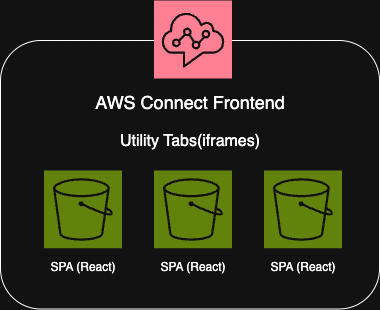

# PARK-GYEONGSIL STORY

```plaintext
5년간 프로젝트에 참여 하거나, 사내의 솔루션을 개발 하면서 가장 강하게 느낀 점은, 무엇이든 시간이 촉박해서 급하게 찍어 내서 만드는 제품/솔루션은 언제 터질지 모르는 폭탄을 만드는 것과 같다 라는 것입니다.
실제로 개발을 시작하고 3년 동안 만든 코드/기능 들은 이후에 저에게 많은 이슈와 문제들이 되어서 돌아 왔었습니다.
아래에 이어갈 이야기들은 처음 3년간 하드코딩으로 쌓아온 업보를 근 2년간 청산하는 이야기 입니다.
```

## Table of Contents

- Project Story
  1. [분양 CRM - Here 서비스 개발](#1-분양-crm---here-서비스-개발)
  2. [(주)힐러비 / 넷마블 & Coway - 구독가능 건강관리 식품&화장품 쇼핑몰 개발](#2-주힐러비--넷마블--coway---구독가능-건강관리-식품화장품-쇼핑몰-개발)
  3. [AI Chatbot 서비스 - AI-지혜 개발](#3-ai-chatbot-서비스---ai-지혜-개발)
  4. [대한항공 AICC(AI Contact Center) 구축 프로젝트](#4-대한항공-aiccai-contact-center-구축-프로젝트)

### 1. 분양 CRM - Here 서비스 개발

> 레이스 컨디션(Race condition) 해결에 대한 내용 스토리에 추가 필요
> 기존에 상담사가 손님을 데려가는(번호표를 뽑는) 로직을 설명 (그림, 이미지, 설명 으로 표현)
> 기존 로직에 대한 문제점 해결을 위해 수정한 로직 그림, 이미지로 표현 하고 설명

### 2. (주)힐러비 / 넷마블 & Coway - 구독가능 건강관리 식품&화장품 쇼핑몰 개발

> send bird API 및 모듈 연동 스토리
> 브릿지 연동 스토리

### 3. AI Chatbot 서비스 - AI-지혜 개발

> 챗봇이 대답하는 프로세스를 도식화, 그림 그리기
> 중간에 추가된 로직의 위치를 그림 으로 표현 하고, 설명

### 4. 대한항공 AICC(AI Contact Center) 구축 프로젝트

> Connect 프론트 페이지에 Utility 기능 탭 들 하나마다 SPA로 개발 하여, 아키텍쳐가 어색함.
> 유틸리티 탭이 하나라도 열려 있다면, 메세지 알람이 팝업 되어야 하기 때문에 여러개의 알람이 뜨지 않게 하기 위해 모든 탭들이 알람이 뜬다는 상태를 공유하기 위해 브라우저의 BroadcastChannel API를 활용
> 기존 아키텍처 그림 그리고, 해당 아키텍처 보다 나라면 이렇게 하겠다는 아키텍처 그림 추가 필요




[처음으로](#park-gyeongsil-story)
