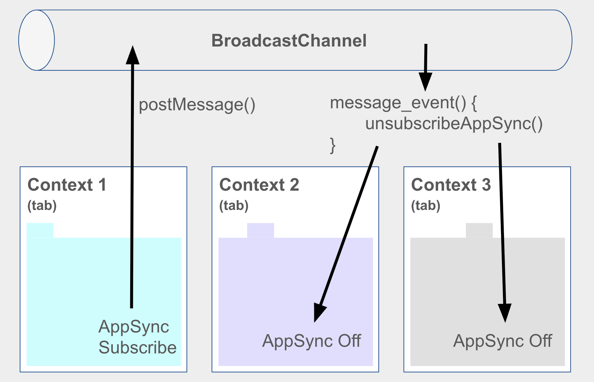

# PARK-GYEONGSIL STORY

```plaintext
5년간 프로젝트에 참여 하거나, 사내의 솔루션을 개발 하면서 가장 강하게 느낀 점은, 무엇이든 시간이 촉박해서 급하게 찍어 내서 만드는 제품/솔루션은 언제 터질지 모르는 폭탄을 만드는 것과 같다 라는 것입니다.
실제로 개발을 시작하고 3년 동안 만든 코드/기능 들은 이후에 저에게 많은 이슈와 문제들이 되어서 돌아 왔었습니다.
아래에 이어갈 이야기들은 처음 3년간 하드코딩으로 쌓아온 업보를 근 2년간 청산하는 이야기 입니다.
```

## Table of Contents

- Project Story
  - [분양 CRM - Here 서비스 개발](#1-분양-crm---here-서비스-개발)
  - [(주)힐러비 / 넷마블 & Coway - 구독가능 건강관리 식품&화장품 쇼핑몰 개발](#2-주힐러비--넷마블--coway---구독가능-건강관리-식품화장품-쇼핑몰-개발)
  - [AI Chatbot 서비스 - AI-지혜 개발](#3-ai-chatbot-서비스---ai-지혜-개발)
  - [대한항공 AICC(AI Contact Center) 구축 프로젝트](#4-대한항공-aiccai-contact-center-구축-프로젝트)

### 1. 분양 CRM - Here 서비스 개발

> 레이스 컨디션(Race condition) 해결에 대한 내용 스토리에 추가 필요
> 기존에 상담사가 손님을 데려가는(번호표를 뽑는) 로직을 설명 (그림, 이미지, 설명 으로 표현)
> 기존 로직에 대한 문제점 해결을 위해 수정한 로직 그림, 이미지로 표현 하고 설명

### 2. (주)힐러비 / 넷마블 & Coway - 구독가능 건강관리 식품&화장품 쇼핑몰 개발

> send bird API 및 모듈 연동 스토리
> 브릿지 연동 스토리

### 3. AI Chatbot 서비스 - AI-지혜 개발

> 챗봇이 대답하는 프로세스를 도식화, 그림 그리기
> 중간에 추가된 로직의 위치를 그림 으로 표현 하고, 설명

### 4. 대한항공 AICC(AI Contact Center) 구축 프로젝트

대한항공 AICC 구축 프로젝트에서는 AWS의 파트너 개발자로 참여하게 되었습니다.
맡은 역할은 [AX(Agent Experience)](#41-ax-파트-개발)와 Admin의 Frontend(React)/Backend(Lambda-Node) 개발로, Typescript로 개발 했습니다.

> 사실 처음에는 Frontend 개발 역할만 수행 했었는데, 중간 부터 개발 속도 상승을 위해 Backend 개발 역할까지 부여 받게 되었습니다.

본 프로젝트를 진행하면서 부딪혔던 이슈들은 모두 AX파트 개발을 진행하면서 발생한 문제들 이었습니다. 아래에서 이슈가 발생한 시간 순서대로 그 이야기를 해보겠습니다.

#### 4.1. AX 파트 개발

#### 4.1.1 브라우저 Broadcast Channel API를 활용한 SPA 상태관리

여느 프로젝트가 그렇듯 초기에는 간단한 기능만으로 구성된 페이지를 기획해서 이를 기반으로 설계를 진행하였고, 개발진행까지 이어졌습니다. 그렇게 결정된 AX 파트의 프론트 구조는 아래 그림과 같습니다. 이후 AX 파트 프론트는 Agent Workspace로 총칭합니다.


- AWS Connect Agent Workspace: 상담원(Agent)이 사용하는 화면의 레이아웃, UI 프레임
- AWS Connect SDK(왼쪽): AWS에서 제공하는 SDK로, Connect API와 통신하면서 전화 연결, 상태 관리, 고객 정보 등을 제어 합니다.
- Utility Tabs: 각 탭 마다 iframe이 하나씩 열리게 됩니다. 상담원은 여러 개의 유틸리티 기능(예: 고객 정보, 결제, 메모 등)

  > iframe 영역에 있는 각 탭별 페이지가 제가 AX파트 Agent Workspace 에서 개발한 영역 입니다.

구조를 보면 예상 되듯이, 대부분의 문제가 iframe 으로 구현한 Utility Tab(기능 페이지)들에서 발생 했습니다.
초기에 계획된 것처럼 Utility Tab에서 정말 간단한 기능들만 구현했다면, 예를들어서 단순하게 각 페이지에서 필요한 정보를 CRUD 하는 기능들만 구현하고 가지고 있는 탭들이었다면 정말 간단했을 겁니다.
하지만 프로젝트가 진행될수록, 클라이언트가 요청하는 기능들은 복잡해져 갔고, 그 복잡한 기능들을 최대한 좋은 UX로 구현하려면 Utility Tab간에는 물론이고 iframe을 가지고 있는 부모 영역과의 상호작용도 필요해 지게 되었습니다.

이를 해결하기 위해서, Broadcastchannel 이라는 브라우저 환경에서 제공하는 API를 활용하게 됩니다.


이 API는 브라우징 맥락들(창, 탭, 프레임, iframe) 사이에서 동일한 출처에 있는 요소들 간의 기본적인 통신을 허용 합니다.

Broadcastchannel API를 사용한 대표적인 기능이 '메세지 알람 기능' 이었습니다. 해당 기능의 요점은 상담사가 로그인 한 상태에서는 항상 본인에게 온 메세지가 브라우저 가장 상단에 팝업 되어야 한다는 것 이었습니다.
현재 프론트의 구조상, 열려있는 탭이 여러개인 경우 메세지 팝업이 탭이 떠 있는 갯수만큼 뜨는 현상이 발생 합니다.
이를 정상적으로 언제나 메세지 팝업이 하나만 뜨로고 구현하기 위해, AWS AppSync의 구독 상태를 핸들링 하는 전역변수를 하나 만들어 두고, 해당 전역변수는 Broadcastchannel 로 부터 받는 메세지 이벤트를 통해서만 On/Off 되도록 하여, 여러개의 탭 중에 한개의 탭에서만 AppSync를 통해서 메세지 팝업 이벤트를 수신할 수 있게 하였습니다.



#### 4.1.2 초기 화면 렌더링 시간 이슈 해결

상담사가 AWS Connect Console에서 로그인 세션을 진행 후 Agent Workspace로 처음 진입했을 때, 새로운 Utility Tab이 열리면서 내부의 SPA(React)가 초기 렌더링 되는데 약 10~15초가 소요되는 문제가 있었습니다.
해당 현상은 SPA가 렌더링 될 때, Sesson 및 Cookie에 저장된 로그인 인증 정보를 Okta SDK를 통해 검증하는 Authentication Logic 에서 시간이 너무 오래 소요되는 것이 원인이었습니다. 따라서 해당 Okta Authentication Logic 을 다른 곳으로 옮기거나, 로직 자체를 최적화 해야 했습니다.


#### 4.1.3 다수의 iframe 내의 SPA에서 로그인 세션 유지

- 계기, 발단, 필요
- 전개, 기능개발
- 해결, 완료, 성과

#### 4.1.4 너무 늦은 구조 변경 제안

프로젝트 후반부에 Agent Workspace 개발을 어느 정도 마무리한 시점에서, 프론트엔드 React 코드가 유지보수 측면에서 충분히 높은 품질을 확보하지 못했음을 확인 했습니다. 또한, 기존 코드의 히스토리를 모두 파악하지 않는 이상 전체 로직을 빠르게 이해하기 어려운 구조가 되어 있었고, 이런 문제는 주로 iframe 기반 기능 구현 영역에서 발생 했습니다.
기존에 단순히 코드 레벨에서의 부분적 수정이나 보완으로는 근본적인 문제가 해결되지 않았습니다. 성공적인 리팩토링과 코드 정리를 위해서는 문제의 원인을 제거하는 것, 즉 프론트엔드 구조 자체를 재설계하는 것이 최선의 접근 방식이었을 것입니다.

하지만 프로젝트 계약 만료가 임박한 상황에서 구조를 바꾸며 리팩토링까지 진행하는 것은 너무 큰 리스크가 되는 시점이었습니다.
좀 더 일찍 용기를 가지고 구조 변경에 대한 제안을 해보지 않았다는 것이 저 스스로 안타깝고 못한 부분이 아닌가 하는 생각이 드는 순간이었습니다.
지금와서 생각해보면 공통 컴포넌트들은 나름 잘 분리해 뒀었고, 전체 레이아웃 페이지라 해봤자 몇개 페이지가 안되는 분량 이었는데 구조를 주도적으로 바꾸자 하니, 덜컥 겁부터 집어 먹은게 아닌가 하는 생각이 듭니다.
결국 프론트 구조는 그대로, 지저분하고 트리키 했던 로직/기능 들은 최대한 코드내 주석과 문서들을 정리하며 AX 개발을 마무리 하였습니다.

만약 시간이 더 여유롭게 있었다면,
아래 그림과 같이 Agent Workspace 전체 화면을 한개의 SPA로 개발해서, SPA의 특장점을 잘 살리는 방향으로 구조를 변경해서 개발했을 것 같습니다.


이렇게 개발했다면, React의 상태관리 라이브러리(Redux)를 활용해서 좀 더 정교하게 상태관리를 할 수 있었을 것 같습니다.

[처음으로](#park-gyeongsil-story)
