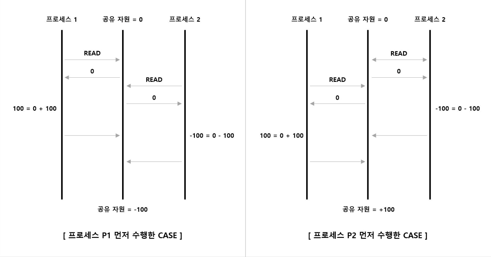
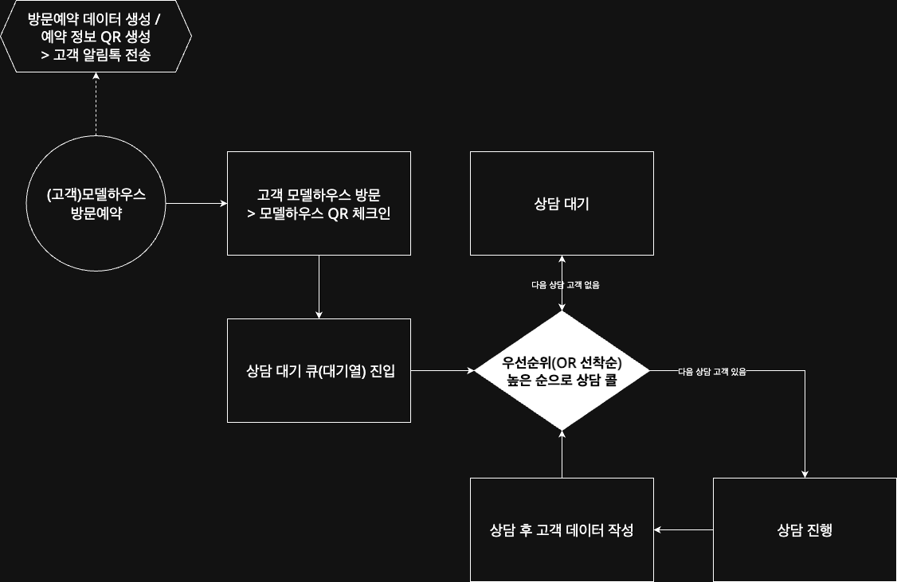
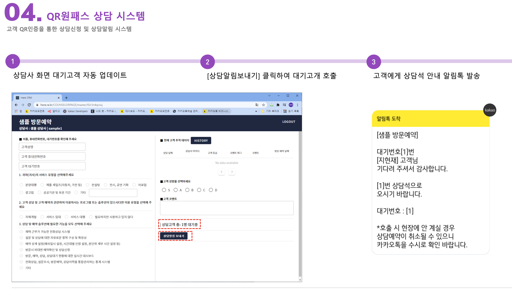
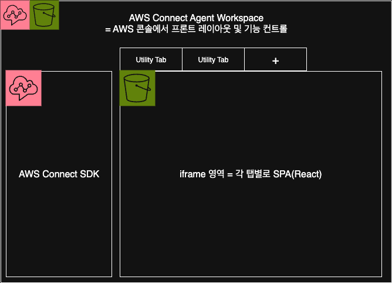
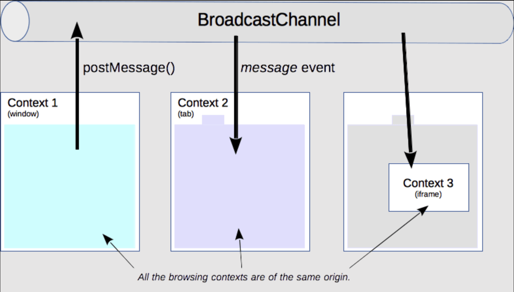
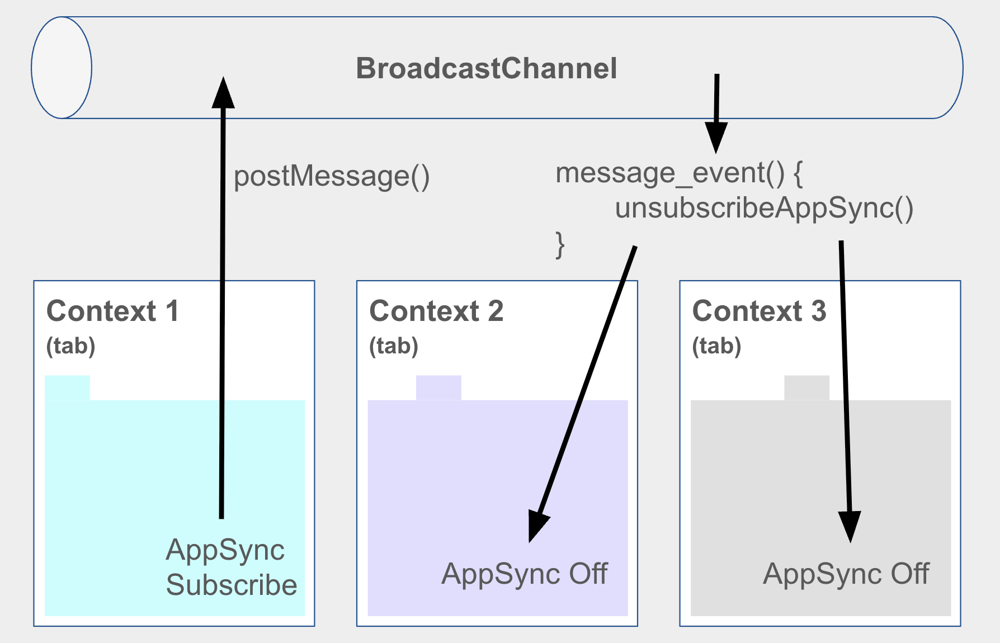
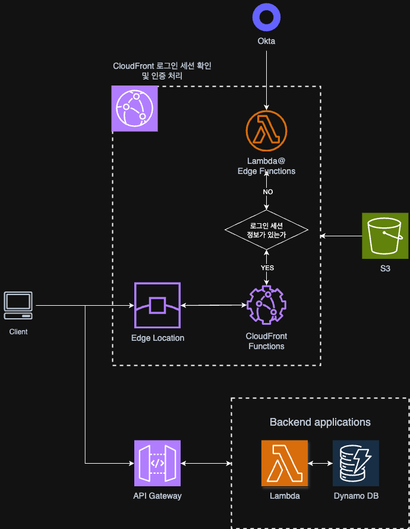
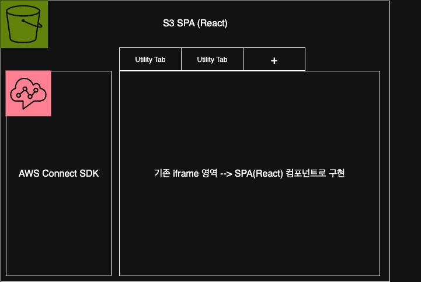

# PARK-GYEONGSIL STORY

```plaintext
5년간 프로젝트에 참여 하거나, 사내의 솔루션을 개발 하면서 가장 강하게 느낀 점은, 무엇이든 시간이 촉박해서 급하게 찍어 내서 만드는 제품/솔루션은 언제 터질지 모르는 폭탄을 만드는 것과 같다 라는 것입니다.
실제로 개발을 시작하고 3년 동안 만든 코드/기능 들은 이후에 저에게 많은 이슈와 문제들이 되어서 돌아 왔었습니다.
아래에 이어갈 이야기들은 처음 3년간 하드코딩으로 쌓아온 업보를 근 2년간 청산하는 이야기 입니다.
```

## Table of Contents

- Project Story
  - [분양 CRM - Here 서비스 개발](#1-분양-crm---here-서비스-개발)
  - [(주)힐러비 / 넷마블 & Coway - 구독가능 건강관리 식품&화장품 쇼핑몰 개발](#2-주힐러비--넷마블--coway---구독가능-건강관리-식품화장품-쇼핑몰-개발)
  - [AI Chatbot 서비스 - AI-지혜 개발](#3-ai-chatbot-서비스---ai-지혜-개발)
  - [대한항공 AICC(AI Contact Center) 구축 프로젝트](#4-대한항공-aiccai-contact-center-구축-프로젝트)

### 1. 분양 CRM - Here 서비스 개발

Here 서비스 개발 프로젝트는 제가 개발자로서 커리어를 시작하게 된 첫 번째 프로젝트 였습니다.
당시 회사에는 저를 포함해 개발자가 총 4명뿐이었고, 그중에서도 저는 Here 솔루션의 90%이상을 직접 개발을 담당해야 했습니다.
어드민 페이지부터 엔드 유저가 사용하는 프론트 페이지까지 대부분의 기능을 처음부터 구현해야 했기 때문에 처음 커리어를 시작하는 당시의 저에게는 그 양이 상당히 방대하고 많게 느껴져, 초반에는 막막함을 많이 느꼈습니다.
다행히 벤치마킹할 수 있는 유사 솔루션을 소개받아 이를 참고하며 기능을 하나씩 더 빠르게 완성해 나갈 수 있었지만, 사람이 아는 만큼 보인다고... 당시의 저는 아직 경험이 부족해 제가 만든 기능들이 어떤 작은 버그나 치명적인 문제를 야기할 수 있을지 충분히 예측하기 어려웠습니다.
아래에서는 제가 Here 서비스 개발 프로젝트에서 경험했던 가장 치명적인 버그와 그에 대한 대처를 한 이야기를 해보겠습니다.

상담사가 고객을 응대하기 위해 번호표(대기열 번호)를 뽑는 로직이 있었습니다.
이 로직은 단순했지만, 동시에 여러 상담사가 버튼을 누르면 같은 번호표가 중복 배정되는 Race Condition 문제가 발생할 수 있었습니다.
테스트 과정에서 해당 문제가 발견되었다면 정말 좋았겠지만... 솔루션이 이미 납품되어, 현장에서 상담원들이 납품된 Here 솔루션을 사용하다가 해당 버그가 발견되어 정말 난처했던 기억이 있습니다.

Race Condition(출처: <https://junhyunny.github.io/information/operating-system/junit/race-condition/>)


기존의 기능 흐름은 아래와 같습니다.


- 고객 모델하우스 방문예약 -> 고객에게 알림톡으로 QR코드 및 예약 정보 전송 -> 모델하우스 상담원이 다음 대기 손님 중 한명 콜(상담 알림톡 보내기) -> 상담 진행 -> 다음 상담 대기 손님 콜 -> 반복

위의 그림에서 보이는 것과 같이, 선착순으로 대기열의 첫번째에 있는 상담 희망 고객 데이터를 상담사가 끌어가게 되는데 이때, 적절한 조치를 해주지 않으면 한개의 DB 데이터에 여러개의 상담사 브라우저가 데이터 변경을 짧은 시간안에 요청할 수 있는 여지가 있습니다.

실제 기존 상담원이 고객 대기열에서 고객 정보를 가져가는 로직에서 DB 조회와 배정이 순차적으로 처리되지 않은 것이 원인으로, 동시에 요청이 들어오면 같은 번호표가 여러번 반환될 수 있는 확률이 충분히 있었습니다.
체감상 0.5초 내에 동시에 다음 상담 버튼을 눌러서 번호표 배정 로직을 타게 되면, 각 브라우저에서 해당 로직을 타고 API가 처리되는 시간 동안 한쪽이 번호를 배정받아 가기 전에 다수의 상담사가 똑같은 고객의 번호(대기순번 중 가장 위에 있는 번호)를 배정 받고 있었습니다.
실제로 이 0.5초 라는 시간은 생각보다 긴 시간이었으며, 해당 버그가 발견된 당일 하루에 4만명이 방문하는 모델하우스에서 해당 버그가 4번 이상 발생했던 걸로 기억합니다.
다행히 당일 현장에서 대기하고 있어서 임시방편으로 해당 버그가 발생할때 마다 바로 기능 흐름을 정상적으로 수정할 수 있었지만, 클라이언트의 신랄한 피드백은 피할 수 없었습니다.

이후 근본적인 해결책으로, 고객 대기열 번호표 배정 로직에 데이터베이스 트랜잭션과 행 단위 Locking을 적용하였습니다.
상담사가 대기열에서 고객을 호출할 때 `SELECT ... FOR UPDATE` 구문을 사용하여 동시에 동일한 고객 데이터가 반환되지 않도록 보장하고, 배정과 상태 변경을 하나의 트랜잭션 안에서 처리할 수 있도록 수정하였습니다.
이를 통해 동시에 여러 상담사가 '상담알림 보내기' 버튼을 눌러도 하나의 고객 데이터가 중복 배정되는 문제를 완전히 해결할 수 있었습니다.


상기한 치명적인 결함 뿐만 아니라, 자잘한 버그들도 실제 사용환경에서 사용자들이 직접 피드백을 가감없이 해주니 아주 정신이 혼미해지는 버그 수정 및 유지/보수 기간을 보냈던 걸로 기억합니다.
이후, 저희 팀은 단순히 기능을 구현하는 것이 개발의 끝이 아니라는 점을 몸소 깨달았습니다.
기능 구현 후에는 단순 테스트에 그치지 않고, 실제 운영 환경과 유사한 다양한 테스트 케이스를 설계하고 스트레스 테스트까지 수행한 뒤에야 PRD(운영환경)에 배포하거나, 하나의 기능 흐름을 완성된 개발 단계로 간주하도록 프로세스를 정립하였습니다.

프로젝트 마무리 과정이 그 어떤 프로젝트 보다 험난했고, 프로젝트 마감 기한을 맞추기 위해 팀원들과 함께 밤낮 가리지 않고 매달렸습니다.
정말 몸이 갈리는 프로젝트 였지만, 많은 경험과 자신감을 얻을 수 있게 된 프로젝트 입니다.

### 2. (주)힐러비 / 넷마블 & Coway - 구독가능 건강관리 식품&화장품 쇼핑몰 개발

#### 2.1 Send bird SDK/API 연동

> send bird API 및 모듈 연동 스토리 Comming soon...

#### 2.2 브릿지 연동

> 브릿지 연동 스토리 Comming soon...

### 3. AI Chatbot 서비스 - AI-지혜 개발

> 챗봇이 대답하는 프로세스를 도식화, 그림 그리기
> 중간에 추가된 로직의 위치를 그림 으로 표현 하고, 설명

### 4. 대한항공 AICC(AI Contact Center) 구축 프로젝트

대한항공 AICC 구축 프로젝트에서는 AWS의 파트너 개발자로 참여하게 되었습니다.
맡은 역할은 AX(Agent Experience)와 Admin의 Frontend(React)/Backend(Lambda-Node) 개발로, Typescript로 개발 했습니다.

> 사실 처음에는 Frontend 개발 역할만 수행 했었는데, 중간 부터 개발 속도 상승을 위해 Backend 개발 역할까지 부여 받게 되었습니다.

본 프로젝트를 진행하면서 부딪혔던 이슈들은 모두 AX파트 개발을 진행하면서 발생한 문제들 이었습니다. 아래에서 이슈가 발생한 시간 순서대로 그 이야기를 해보겠습니다.

#### 4.1 브라우저 Broadcast Channel API를 활용한 SPA 상태관리

여느 프로젝트가 그렇듯 초기에는 간단한 기능만으로 구성된 페이지를 기획해서 이를 기반으로 설계를 진행하였고, 개발진행까지 이어졌습니다. 그렇게 결정된 AX 파트의 프론트 구조는 아래 그림과 같습니다. 이후 AX 파트 프론트는 Agent Workspace로 총칭합니다.


- AWS Connect Agent Workspace: 상담원(Agent)이 사용하는 화면의 레이아웃, UI 프레임
- AWS Connect SDK(왼쪽): AWS에서 제공하는 SDK로, Connect API와 통신하면서 전화 연결, 상태 관리, 고객 정보 등을 제어 합니다.
- Utility Tabs: 각 탭 마다 iframe이 하나씩 열리게 됩니다. 상담원은 여러 개의 유틸리티 기능(예: 고객 정보, 결제, 메모 등)

  > iframe 영역에 있는 각 탭별 페이지가 제가 AX파트 Agent Workspace 에서 개발한 영역 입니다.

구조를 보면 예상 되듯이, 대부분의 문제가 iframe 으로 구현한 Utility Tab(기능 페이지)들에서 발생 했습니다.
초기에 계획된 것처럼 Utility Tab에서 정말 간단한 기능들만 구현했다면, 예를들어서 단순하게 각 페이지에서 필요한 정보를 CRUD 하는 기능들만 구현하고 가지고 있는 탭들이었다면 정말 간단했을 겁니다.
하지만 프로젝트가 진행될수록, 클라이언트가 요청하는 기능들은 복잡해져 갔고, 그 복잡한 기능들을 최대한 좋은 UX로 구현하려면 Utility Tab간에는 물론이고 iframe을 가지고 있는 부모 영역과의 상호작용도 필요해 지게 되었습니다.

이를 해결하기 위해서, Broadcastchannel 이라는 브라우저 환경에서 제공하는 API를 활용하게 됩니다.


(출처: <https://developer.mozilla.org/ko/docs/Web/API/Broadcast_Channel_API>)

이 API는 브라우징 맥락들(창, 탭, 프레임, iframe) 사이에서 동일한 출처에 있는 요소들 간의 기본적인 통신을 허용 합니다.

Broadcastchannel API를 사용한 대표적인 기능이 '메세지 알람 기능' 이었습니다. 해당 기능의 요점은 상담사가 로그인 한 상태에서는 항상 본인에게 온 메세지가 브라우저 가장 상단에 팝업 되어야 한다는 것 이었습니다.
현재 프론트의 구조상, 열려있는 탭이 여러개인 경우 메세지 팝업이 탭이 떠 있는 갯수만큼 뜨는 현상이 발생 합니다.
이를 정상적으로 언제나 메세지 팝업이 하나만 뜨로고 구현하기 위해, AWS AppSync의 구독 상태를 핸들링 하는 전역변수를 하나 만들어 두고, 해당 전역변수는 Broadcastchannel 로 부터 받는 메세지 이벤트를 통해서만 On/Off 되도록 하여, 여러개의 탭 중에 한개의 탭에서만 AppSync를 통해서 메세지 팝업 이벤트를 수신할 수 있게 하였습니다.



#### 4.2 다수의 iframe 내의 SPA에서 로그인 세션 유지

상담사가 AWS Connect console을 통해 Okta로 통합 로그인을 진행했음에도 불구하고, iframe 내에서 로그인 세션이 진행되며 다시 로그인을 요청하는 이슈가 발생 했었습니다.
해당 이슈는 iframe 에서 요청하는 웹페이지의 도메인이 부모페이지의 도메인과 달라서, 브라우저에서 동일 출처로 인식되지 않으므로 쿠키와 세션이 공유되지 않기 때문에 발생하는 이슈 였습니다.

이를 해결하기 위해 일단, Okta 및 로그인을 처리하는 로직상에서 쿠키에서 SameSite 옵션을 None 으로 하고 Secure 옵션을 추가할 필요가 있었습니다.
그리고 CORS 옵션과 withCredentials 옵션 역시 맞춰주고, 마지막으로 iframe 태그에서도 sandbox="allow-same-origin allow-scripts" 옵션을 추가해 줄 필요가 있었는데 해당 옵션들은 Chrome 브라우저를 포함한 일부 브라우저에서만 작동하는 옵션 값이라고 합니다.
다행히 상담사들은 Chrome 브라우저만 사용하도록 교육할 예정이라고 하여 해당 옵션을 Utility Tab으로 생성되는 iframe 태그에 추가하도록 AWS Connect Workspace 개발팀에 요청할 수 있었습니다.
Safari, iOS Webview 브라우저에서는 다른 다른 출처의(cross-site) 쿠키를 아예 막는다고 하는데, 만약 다른 브라우저를 사용할 예정이었다면 AWS Connect Workspace 의 도메인과 똑같이 맞추는 방향으로 수정해야 했을 것 같습니다.

순서대로 다시 써보면

- 쿠키에 SameSite=NONE, Secure 옵션 추가
- 서버단에 CORS옵션과 withCredentials 옵션 추가
- iframe 태그에 sandbox="allow-same-origin allow-scripts" 옵션 및 속성 추가

이렇게 iframe 내에서도 로그인 세션을 그대로 유지하고 있는 것처럼 동작이 가능하게 되었습니다.

위의 과정을 일이 진행된 순서대로 말로만 쓰다보니 하루아침에 모든 사항이 고려되고 쉽게 처리된 것 처럼 적혀졌지만, 사실 생각보다 험난한 디버깅 과정들이 있었음을 이곳에 밝힙니다. AWS Connect Workspace 팀이 업무를 하는 시간이 프로젝트 내 개발자들의 업무시간과 겹치지 않는 시간이라는 점과 수정요청을 한번 하는 데도 테스트 케이스를 정말 꼼꼼히 만들고 '이렇게 하면 된다!' 하는 확신이 간신히 섰을때 수정요청을 보낼 수 있었으며, 수정 요청사항을 검토하고 반영까지 해주는데 얼마나 걸릴지 알 수 없는 상황이어서 꽤나 애간장을 태웠던거 같습니다.

#### 4.3 초기 화면 렌더링 시간 이슈 해결

상담사가 AWS Connect Console에서 로그인 세션을 진행 후 Agent Workspace로 처음 진입했을 때, 새로운 Utility Tab이 열리면서 내부의 SPA(React)가 초기 렌더링 되는데 약 10~15초가 소요되는 문제가 있었습니다.
해당 현상은 SPA가 렌더링 될 때, Sesson 및 Cookie에 저장된 로그인 인증 정보를 Okta SDK를 통해 검증하는 Authentication Logic 에서 시간이 너무 오래 소요되는 것이 원인이었습니다. 따라서 해당 Okta Authentication Logic 을 다른 곳으로 옮기거나, 로직 자체를 최적화 해야 했습니다.
SPA에 Auth Logic이 남아 있는 경우에 Okta 로그인 세션 페이지로 리다이렉트 되는 과정에서 화면이 순간 반짝이는 현상이 상담사의 UX(유저경험)를 저해 할 수 있다는 의견이 있어, 인증 로직 자체를 SPA 바깥으로 빼내서 관리 하도록 결정 하였습니다.



상담사가 Utility Tab + 기능을 활용해서 화면상에 새로운 iframe 태그를 만들면 iframe 내부에서 출력될 페이지를 CloudFront의 Edge Location을 통해 redirect 하게 됩니다. 우리팀은 이 Edge Location 에서 캐싱 되어 있는 정적자원을 가지고 오기 전에, CloudFront Functions 를 활용해서 Authentication Locic을 끼워 넣기로 했습니다.
CloudFront Functions에서 요청 헤더와 쿠키에 로그인 세션 정보가 있는지 판단합니다.
로그인 세션 정보가 없다면 Okta Authentication Logic을 Lambda@Edge Functions 에서 실행해, 서버단에서 로그인 검증 로직을 실행합니다.

위의 그림처럼 검증로직을 옮김으로써, iframe 화면 초기 렌더링 시간을 약 10~15초 에서 3초 미만으로 개선할 수 있었습니다(렌더링 속도 70% 이상 단축).

#### 4.4 너무 늦은 구조 변경 제안

프로젝트 후반부에 Agent Workspace 개발을 어느 정도 마무리한 시점에서, 프론트엔드 React 코드가 유지보수 측면에서 충분히 높은 품질을 확보하지 못했음을 확인 했습니다. 또한, 기존 코드의 히스토리를 모두 파악하지 않는 이상 전체 로직을 빠르게 이해하기 어려운 구조가 되어 있었고, 이런 문제는 주로 iframe 기반 기능 구현 영역에서 발생 했습니다.
기존에 단순히 코드 레벨에서의 부분적 수정이나 보완으로는 근본적인 문제가 해결되지 않았습니다. 성공적인 리팩토링과 코드 정리를 위해서는 문제의 원인을 제거하는 것, 즉 프론트엔드 구조 자체를 재설계하는 것이 최선의 접근 방식이었을 것입니다.

하지만 프로젝트 계약 만료가 임박한 상황에서 구조를 바꾸며 리팩토링까지 진행하는 것은 너무 큰 리스크가 되는 시점이었습니다.
좀 더 일찍 용기를 가지고 구조 변경에 대한 제안을 해보지 않았다는 것이 저 스스로 안타깝고 못한 부분이 아닌가 하는 생각이 드는 순간이었습니다.
지금와서 생각해보면 공통 컴포넌트들은 나름 잘 분리해 뒀었고, 전체 레이아웃 페이지라 해봤자 몇개 페이지가 안되는 분량 이었는데 구조를 주도적으로 바꾸자 하니, 덜컥 겁부터 집어 먹은게 아닌가 하는 생각이 듭니다.
결국 프론트 구조는 그대로, 지저분하고 트리키 했던 로직/기능 들은 최대한 코드내 주석과 문서들을 정리하며 AX 개발을 마무리 하였습니다.

만약 시간이 더 여유롭게 있었다면,
아래 그림과 같이 Agent Workspace 전체 화면을 한개의 SPA로 개발해서, SPA의 특장점을 잘 살리는 방향으로 구조를 변경해서 개발했을 것 같습니다.



이렇게 개발했다면, React의 상태관리 라이브러리(Redux)를 활용해서 좀 더 정교하게 상태관리를 할 수 있었을 것 같습니다.

[처음으로](#park-gyeongsil-story)
